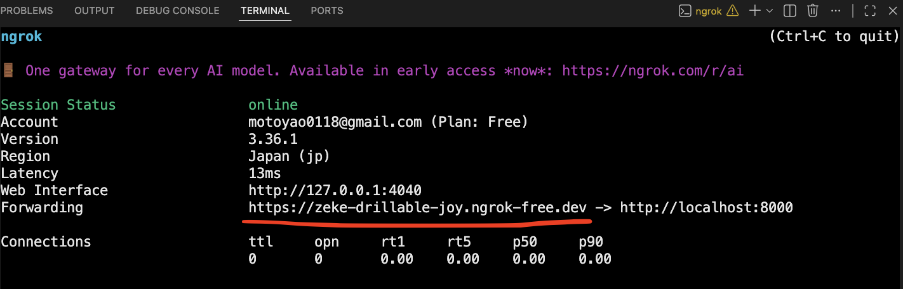
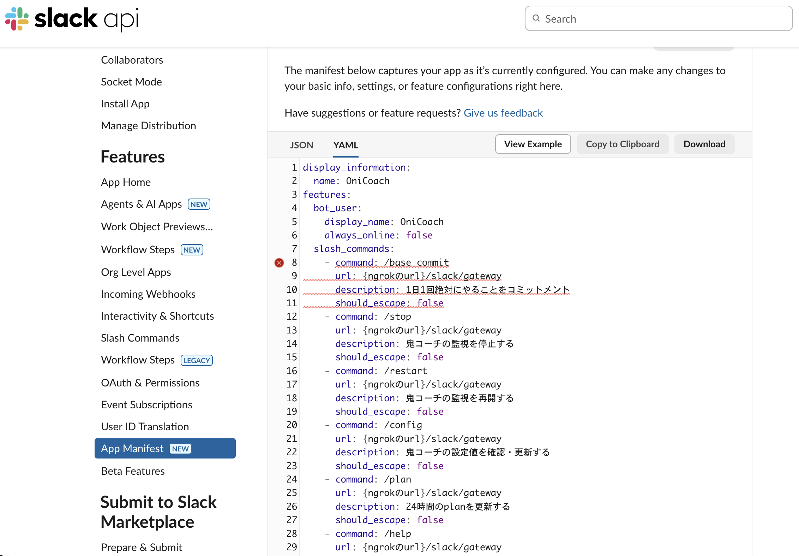
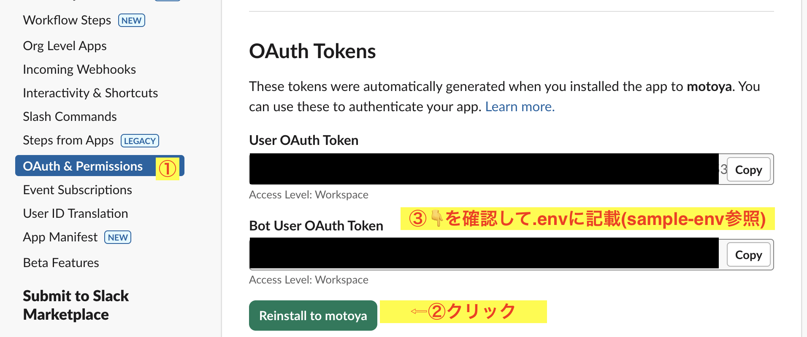
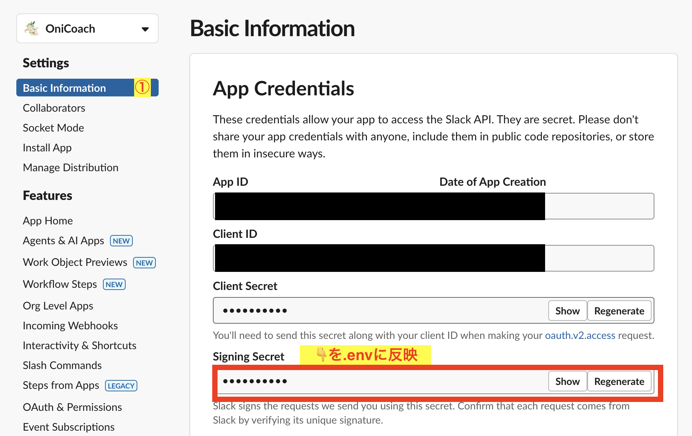
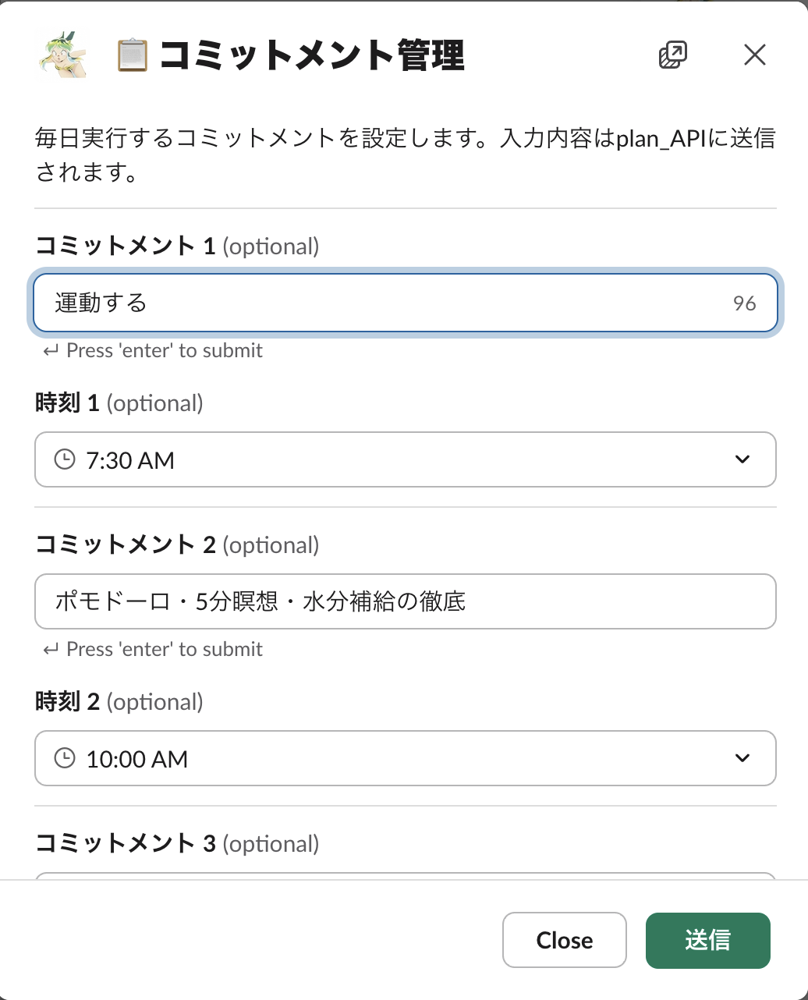

# 鬼コーチシステム


## 🎥 Demo – Click to Play
こちらの画面例は実際のデモ動画です（再生するとYouTubeで開きます）

[](https://www.youtube.com/watch?v=lU8K9ElBvY8)

## 背景
私は意志が弱い人間のため
`悪習慣を自分の意思で辞め良い習慣を継続していく`
ということが`36年間`できていない。

また、私は他者に監視されることを嫌う人間のため、
`誰かに強制される`
ということに耐えられない。

この問題を解決するために世にある`コーチング支援`ツールを導入しても、
既製品では`強制力`が弱いため弱い自分に負けて辞めてしまうことを繰り返してきた。

本PJは、上記の問題を解決するために
`鬼コーチにコーチング対象者へ行動を強制する権限`を付与することで
`自身で設定した目標`に対して矛盾しない行動、思考をするように`矯正`すること
を目的としている。


## 前提
- `uv`がインストール済みであること
- `codex CLI`がインストール済みで利用可能なこと

## 手順導入
### 1. プロジェクト側設定
#### 1-1. レポジトリのクローン
```bash
cd {your dir}
git clone https://github.com/motoya0118/pavlok_CLI_agent.git
```

#### 1-2. ライブラリ類の導入
```bash
uv sync
```

#### 1-3. .envの設定
`sample-env`を参照し、`.env`を作成します

**※ pavlok, slackのenv情報は後続手順で発行し設定します**

### 2. pavlok設定
#### 2-1. pavlok本体を購入します
- [日本代理店](https://www.pavlok-japan-official.com/top)
- [本社](https://www.pavlok.com/)

#### 2-2. `pavlokアカウント新規作成` & `pavlok本体とアカウント紐付け`を行います
   - [解説動画](https://video.wixstatic.com/video/3cbb88_fafe1dda81a346d48023698dbda68355/1080p/mp4/file.mp4)
#### 2-3. pavlok公式サーバーから`API_KEY`を取得します
1. [pavlok公式_APIDOC](https://pavlok.readme.io/reference/intro/authentication)にアクセスします
2. `Log in to see your API keys`をクリックします
   
3. メールアドレスを入力し、`Send LogIn Link`をクリックします
   
4. メールが届くので`Log In`をクリックします
 
5. Authページに`API_KEY`が表示されているのでコピーします **prefixの`Bearer `を除いたものが`PAVLOK_API_KEY`です**
   
6. .envの`PAVLOK_API_KEY`項に設定します

### 3. ngorkの設定
#### 3-1. ngorkのアカウントを作成する
[こちら](https://ngrok.com/?homepage-cta-docs=control)からアカウントを作成する

#### 3-2. ngrokをインストールする
```bash
brew install ngrok/ngrok/ngrok
```

#### 3-3. ngrokにauthトークンを設定する
```bash
ngrok config {ngrokダッシュボードに書いてるauthトークン}
```

#### 3-4. 8000番ポートでngorkを起動する

```bash
ngrok http 8000
```

#### 3-5. ngorkから発行されたurlを確認する
**※ 停止するとurlが変わるので試用中は停止しないように注意**


### 4. slack設定
#### 4-1. BOTユーザーを作成する
[こちら](https://zenn.dev/kou_pg_0131/articles/slack-api-post-message)の手順の
`アプリを作成する`までを実施します。

#### 4-2. ワークスペースのチャンネルにbotを招待する
1. [こちら](https://zenn.dev/kou_pg_0131/articles/slack-api-post-message#%E3%82%A2%E3%83%97%E3%83%AA%E3%82%92%E3%83%81%E3%83%A3%E3%83%B3%E3%83%8D%E3%83%AB%E3%81%AB%E8%BF%BD%E5%8A%A0%E3%81%99%E3%82%8B)の`アプリをチャンネルに追加する`手順を実施
2. botを追加した`チャンネル名`を.envの`SLACK_CHANNEL`項に反映します
   - 例: #lum_chan -> SLACK_CHANNEL=lum_chan

#### 4-3. 鬼コーチ用の設定をslack botに反映する


```yaml
display_information:
  name: OniCoach
features:
  bot_user:
    display_name: OniCoach
    always_online: false
  slash_commands:
    - command: /base_commit
      url: {ngorkのurl}/slack/gateway
      description: 1日1回絶対にやることをコミットメント
      should_escape: false
    - command: /stop
      url: {ngorkのurl}/slack/gateway
      description: 鬼コーチの監視を停止する
      should_escape: false
    - command: /restart
      url: {ngorkのurl}/slack/gateway
      description: 鬼コーチの監視を再開する
      should_escape: false
    - command: /config
      url: {ngorkのurl}/slack/gateway
      description: 鬼コーチの設定値を確認・更新する
      should_escape: false
    - command: /plan
      url: {ngorkのurl}/slack/gateway
      description: 24時間のplanを更新する
      should_escape: false
    - command: /help
      url: {ngorkのurl}/slack/gateway
      description: 鬼コーチの概要・コマンド説明・注意点
      should_escape: false
oauth_config:
  scopes:
    user:
      - channels:history
      - chat:write
    bot:
      - channels:history
      - chat:write
      - groups:history
      - commands
settings:
  interactivity:
    is_enabled: true
    request_url: {ngorkのurl}
  org_deploy_enabled: false
  socket_mode_enabled: false
  token_rotation_enabled: false
```

#### 4-4. 設定を反映し、.envのSLACK_BOT_USER_OAUTH_TOKEN項に設定する


#### 4-5. .envのSLACK_SIGNING_SECRET項に設定する


### 5. アプリケーションの実行
#### 5-1. プロセス起動
**👇は別ターミナルで起動してください**

```bash
uv run python -m backend.worker.worker
```

```bash
uv run uvicorn backend.main:app --host 0.0.0.0 --port 8000
```

#### 5-2. slackで操作
botを招待したチャンネルで`/base_commit`コマンドを実行してslackモーダルが表示されれば成功です!
**詳細なユーザー操作方法は**、[こちら](./documents/v0.3/user_guide.md)を参照してください

